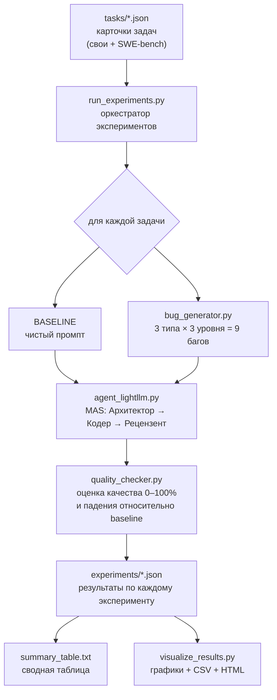

# Тестирование отказоустойчивости мультиагентных систем в условиях неполной, противоречивой и шумной информации

Научно-исследовательская работа и программный стенд для оценки **отказоустойчивости
мультиагентной системы (MAS)** при разработке ПО. Идея: берём корректную постановку
задачи, искусственно «портим» её (неполнота, шум, противоречия), прогоняем через
мультиагентную систему и измеряем, **насколько падает качество результата**.

---

## Содержание

- [Научная постановка](#научная-постановка)
- [Архитектура и конвейер](#архитектура-и-конвейер)
- [Структура репозитория](#структура-репозитория)
- [Установка](#установка)
- [Настройка доступа к LLM (.env)](#настройка-доступа-к-llm-env)
- [Быстрый старт](#быстрый-старт)
- [Полный цикл воспроизведения](#полный-цикл-воспроизведения)
- [Методология](#методология)
- [Формат данных](#формат-данных)
- [Визуализация результатов](#визуализация-результатов)
- [Как провести демонстрацию на защите](#как-провести-демонстрацию-на-защите)
- [FAQ и типичные проблемы](#faq-и-типичные-проблемы)

---

## Научная постановка

**Объект исследования:** мультиагентная система из трёх ролей (Архитектор → Кодер →
Рецензент), решающая задачи разработки ПО.

**Предмет исследования:** устойчивость качества результата MAS к деградации входных
данных.

**Исследовательские вопросы:**

1. Насколько снижается качество результата MAS при разных типах повреждения промпта?
2. Какой тип повреждения (неполнота / шум / противоречие) наиболее критичен?
3. Как интенсивность повреждения (низкая / средняя / высокая) влияет на падение качества?

**Типы вносимых дефектов (fault injection):**

| Тип | Что моделирует | Как реализуется |
|-----|----------------|-----------------|
| `incomplete` (неполнота) | потеря части требований | удаление случайных слов из промпта |
| `noise` (шум) | помехи в канале / грязные данные | добавление мусорных символов и текста |
| `contradiction` (противоречие) | конфликтующие требования | добавление невыполнимого условия |

Каждый тип применяется с тремя уровнями интенсивности: `low` (10%), `medium` (30%),
`high` (60%).

---

## Архитектура и конвейер



Пошагово (это и есть план работы репозитория):

```
1. ЗАГРУЗКА ЗАДАЧ
   ├── run_experiments.py читает все JSON из tasks/
   └── Загружено: N задач (SWE-bench + собственные)

2. ДЛЯ КАЖДОЙ ЗАДАЧИ:
   ├── 2.1. BASELINE (без бага)
   │   ├── agent_lightllm.py запускает 3 агентов:
   │   │   ├── Architect → создаёт план
   │   │   ├── Coder → пишет код по плану
   │   │   └── Reviewer → проверяет код
   │   ├── quality_checker.py оценивает качество (0–100%)
   │   └── Сохраняется: NN_baseline_<task>.json
   │
   └── 2.2. БАГИ (3 типа × 3 уровня = 9 экспериментов)
       ├── bug_generator.py генерирует баговый промпт
       │   ├── incomplete (удаляет слова)
       │   ├── noise (добавляет шум)
       │   └── contradiction (добавляет противоречия)
       ├── agent_lightllm.py запускает MAS на баговом промпте
       ├── quality_checker.py: качество + падение относительно baseline (%)
       └── Сохраняется: NN_<bugtype>_<level>_<task>.json

3. ПОСЛЕ ВСЕХ ЗАДАЧ:
   ├── Агрегация результатов
   ├── summary_table.txt (текстовая таблица)
   └── visualize_results.py → графики, CSV, HTML-отчёт
```

---

## Структура репозитория

```
nir_mas/
├── agent_lightllm.py        # Мультиагентная система (Архитектор → Кодер → Рецензент)
├── bug_generator.py         # Генератор дефектов (fault injection)
├── quality_checker.py       # Оценка качества и падения качества
├── run_experiments.py       # ГЛАВНЫЙ скрипт: прогон всех экспериментов по tasks/
├── run_robustness_test.py   # Быстрый смоук-тест на 3 встроенных задачах
├── visualize_results.py     # Построение графиков, CSV и HTML-отчёта
├── download_swe_bench.py    # (опц.) Скачивание задач FastAPI из SWE-bench
├── convert_to_tasks.py      # (опц.) Конвертация SWE-bench → карточки tasks/
│
├── tasks/                   # Карточки задач (вход): свои + SWE-bench
│   └── swe_*.json
├── experiments/             # Результаты экспериментов (выход)
│   ├── NN_baseline_*.json
│   ├── NN_<bugtype>_<level>_*.json
│   └── summary_table.txt
├── reports/                 # Графики и отчёты (создаётся visualize_results.py)
├── logs/                    # Сырые ответы LLM
├── demo_workspace/          # Артефакты последнего запуска MAS (architecture.md, и т.д.)
│
├── requirements.txt
├── .env.example             # Шаблон конфигурации (скопировать в .env)
└── README.md
```

---

## Установка

Требуется **Python 3.10+** (проект разрабатывался на 3.12).

### Windows (PowerShell)

```powershell
python -m venv venv312
.\venv312\Scripts\Activate.ps1
pip install -r requirements.txt
```

### Linux / macOS

```bash
python3 -m venv venv312
source venv312/bin/activate
pip install -r requirements.txt
```

---

## Настройка доступа к LLM (.env)

Система обращается к LLM через OpenAI-совместимый API. Скопируйте шаблон и заполните:

```powershell
Copy-Item .env.example .env   # PowerShell
# или
cp .env.example .env          # Linux/macOS
```

`.env`:

```env
LLM_API_KEY=ваш_ключ
LLM_MODEL=имя_модели          # например qwen2.5-coder-32b-instruct / gpt-4o-mini
LLM_BASE_URL=https://api.провайдер.com/v1   # опционально, для официального OpenAI можно убрать
```

> `.env` добавлен в `.gitignore` и не попадёт в репозиторий.

---

## Быстрый старт

Проверить, что MAS вообще отвечает (один прогон трёх агентов):

```bash
python agent_lightllm.py --brief "Создай класс BankAccount на Python с методами deposit, withdraw и get_balance"
```

Быстрый смоук-тест отказоустойчивости на 3 встроенных задачах (9 багов на каждую):

```bash
python run_robustness_test.py
```

Построить графики по уже накопленным результатам в `experiments/`:

```bash
python visualize_results.py
```

---

## Полный цикл воспроизведения

```bash
# (опц.) 1. Скачать задачи FastAPI из SWE-bench (нужна библиотека datasets)
pip install datasets
python download_swe_bench.py

# (опц.) 2. Превратить их в карточки задач в tasks/
python convert_to_tasks.py

# 3. Прогнать все эксперименты (baseline + 9 багов на каждую задачу)
python run_experiments.py                 # все задачи
python run_experiments.py --limit 3       # только первые 3 задачи (для отладки)
python run_experiments.py --timeout 300   # таймаут на один вызов MAS, сек

# 4. Построить графики и отчёт
python visualize_results.py
```

Результаты: отдельные JSON в `experiments/`, текстовая таблица `experiments/summary_table.txt`,
графики и HTML-отчёт в `reports/`.

---

## Методология

### Оценка качества (`quality_checker.py`)

Качество ответа MAS оценивается в диапазоне `0..1` как взвешенная комбинация:

- **покрытие ключевых слов** задачи (`keywords`);
- **полнота агентов** — присутствие плана, кода и рецензии (3 роли);
- **качество кода** — наличие и объём кодовых блоков;
- **длина/содержательность** ответа;
- для SWE-bench дополнительно — **покрытие предметных терминов** (из issue и патча).

### Падение качества (degradation)

```
loss_percent = (baseline_quality − buggy_quality) / baseline_quality × 100
```

Критерии устойчивости:

| Падение качества | Вердикт |
|------------------|---------|
| 🟢 < 20% | система **устойчива** к данному типу бага |
| 🟡 20–50% | средняя уязвимость |
| 🔴 > 50% | система **уязвима** |

Сводная таблица по всем задачам формируется автоматически в
`experiments/summary_table.txt`.

---

## Формат данных

### Карточка задачи (`tasks/*.json`)

```json
{
  "id": "bank_account",
  "name": "Банковский счёт",
  "prompt": "Создай класс BankAccount на Python с методами deposit, withdraw и get_balance",
  "keywords": ["class", "BankAccount", "deposit", "withdraw", "get_balance", "def"],
  "difficulty": "medium",
  "category": "oop"
}
```

Для задач SWE-bench добавляется блок `swe_metadata` (`repo`, `base_commit`, `patch`).
Чтобы добавить **свою** задачу — просто положите новый JSON такого формата в `tasks/`.

### Результат эксперимента (`experiments/*.json`)

```json
{
  "experiment_id": "contradiction_high_bank_account",
  "task_id": "bank_account",
  "bug_type": "contradiction",
  "intensity": "high",
  "buggy_prompt": "... но не используй циклы (это обязательно)",
  "success": true,
  "baseline_quality": 0.86,
  "buggy_quality": 0.74,
  "quality_loss_percent": 14.0,
  "is_robust": true,
  "response_length": 3386,
  "elapsed_time": 12.3
}
```

---

## Визуализация результатов

`visualize_results.py` читает всю папку `experiments/`, агрегирует метрики и строит:

| Файл (в `reports/`) | Что показывает |
|---------------------|----------------|
| `heatmap_degradation.png` | тепловая карта среднего падения качества (тип бага × уровень) |
| `bars_by_bugtype.png` | столбчатая диаграмма падения качества по типам и уровням |
| `robustness_share.png` | распределение устойчивых/средних/уязвимых ответов |
| `quality_baseline_vs_bug.png` | сравнение качества baseline vs баговый промпт |
| `summary.csv` | сводная таблица (готова для вставки в статью / Excel) |
| `report.html` | единый HTML-отчёт со всеми графиками — удобно открыть на защите |

Запуск:

```bash
python visualize_results.py
# или с указанием путей:
python visualize_results.py --experiments experiments --out reports
```

Скрипт также печатает текстовую сводную таблицу в консоль. Если `matplotlib` не
установлен, графики пропускаются, но CSV и текстовая таблица всё равно создаются.

---

## Как провести демонстрацию на защите

1. Показать **структуру и идею** (этот README, диаграмма конвейера).
2. Запустить один прогон MAS вживую:
   `python agent_lightllm.py --brief "..."` — видно работу трёх агентов
   (логи `[MULTI-AGENT] Шаг 1/3 ...` идут в stderr).
3. Показать накопленные результаты: открыть `reports/report.html` в браузере —
   там сводная таблица и все графики.
4. Прокомментировать вывод: к какому типу багов MAS устойчива, а к какому — нет.

> Совет: полный прогон `run_experiments.py` по всем задачам долгий (много вызовов LLM).
> Для живой демонстрации используйте `--limit 1` или заранее подготовленные результаты
> в `experiments/` и сразу стройте графики `visualize_results.py`.

---

## FAQ и типичные проблемы

**`LLM_API_KEY and LLM_MODEL must be set in .env`** — не заполнен `.env`
(см. [настройку](#настройка-доступа-к-llm-env)).

**`Request timed out` / `ConnectTimeout`** — сетевой таймаут или прокси.
`run_experiments.py` отключает прокси-переменные перед вызовом MAS; при необходимости
проверьте `HTTP_PROXY`/`HTTPS_PROXY` и доступность `LLM_BASE_URL`. Увеличьте таймаут:
`python run_experiments.py --timeout 600`.

**`matplotlib не установлен`** — выполните `pip install matplotlib`
(или `pip install -r requirements.txt`).

**Кодировка/кракозябры в Windows** — скрипты используют UTF-8;
запускайте из активированного venv. При необходимости: `set PYTHONIOENCODING=utf-8`.

**Нет задач** — папка `tasks/` пуста. Скачайте SWE-bench (`download_swe_bench.py`
+ `convert_to_tasks.py`) или добавьте свои карточки задач в `tasks/`.
