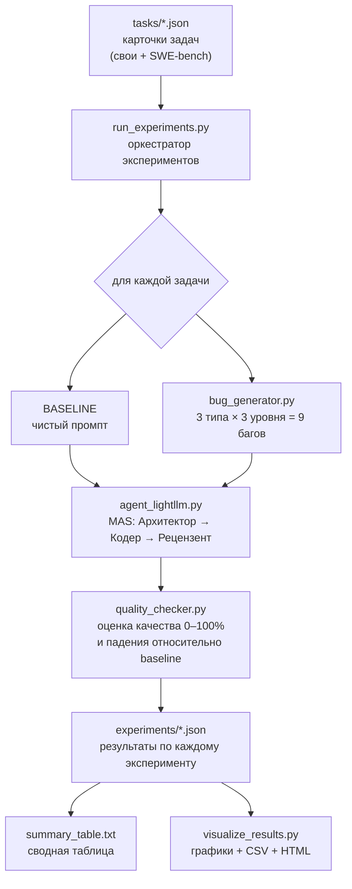

# Тестирование отказоустойчивости мультиагентных систем в условиях неполной, противоречивой и шумной информации

Научно-исследовательская работа и программный стенд для оценки **отказоустойчивости
мультиагентной системы (MAS)**.

---

## Научная постановка

**Объект исследования:** мультиагентная система из трёх ролей (Архитектор → Кодер →
Рецензент), решающая задачи разработки ПО.

**Предмет исследования:** устойчивость качества результата MAS к деградации входных
данных.

**Исследовательские вопросы:**

1. Насколько снижается качество результата MAS при разных типах повреждения промпта?
2. Какой тип повреждения (неполнота / шум / противоречие) наиболее критичен?
3. Как интенсивность повреждения (низкая / средняя / высокая) влияет на падение качества?

**Типы вносимых дефектов (fault injection):**

| Тип | Что моделирует | Как реализуется |
|-----|----------------|-----------------|
| `incomplete` (неполнота) | потеря части требований | удаление случайных слов из промпта |
| `noise` (шум) | помехи в канале / грязные данные | добавление мусорных символов и текста |
| `contradiction` (противоречие) | конфликтующие требования | добавление невыполнимого условия |

Каждый тип применяется с тремя уровнями интенсивности: `low` (10%), `medium` (30%),
`high` (60%).

---

## Архитектура и конвейер




```
1. ЗАГРУЗКА ЗАДАЧ
   ├── run_experiments.py читает все JSON из tasks/
   └── Загружено: N задач (SWE-bench + собственные)

2. ДЛЯ КАЖДОЙ ЗАДАЧИ:
   ├── 2.1. BASELINE (без бага)
   │   ├── agent_lightllm.py запускает 3 агентов:
   │   │   ├── Architect → создаёт план
   │   │   ├── Coder → пишет код по плану
   │   │   └── Reviewer → проверяет код
   │   ├── quality_checker.py оценивает качество (0–100%)
   │   └── Сохраняется: NN_baseline_<task>.json
   │
   └── 2.2. БАГИ (3 типа × 3 уровня = 9 экспериментов)
       ├── bug_generator.py генерирует баговый промпт
       │   ├── incomplete (удаляет слова)
       │   ├── noise (добавляет шум)
       │   └── contradiction (добавляет противоречия)
       ├── agent_lightllm.py запускает MAS на баговом промпте
       ├── quality_checker.py: качество + падение относительно baseline (%)
       └── Сохраняется: NN_<bugtype>_<level>_<task>.json

3. ПОСЛЕ ВСЕХ ЗАДАЧ:
   ├── Агрегация результатов
   ├── summary_table.txt (текстовая таблица)
   └── visualize_results.py → графики, CSV, HTML-отчёт
```

---

## Структура репозитория

```
nir_mas/
├── agent_lightllm.py        # Мультиагентная система (Архитектор → Кодер → Рецензент)
├── bug_generator.py         # Генератор дефектов (fault injection)
├── quality_checker.py       # Оценка качества и падения качества
├── run_experiments.py       # ГЛАВНЫЙ скрипт: прогон всех экспериментов по tasks/
├── run_robustness_test.py   # Быстрый смоук-тест на 3 встроенных задачах
├── visualize_results.py     # Построение графиков, CSV и HTML-отчёта
├── download_swe_bench.py    # (опц.) Скачивание задач FastAPI из SWE-bench
├── convert_to_tasks.py      # (опц.) Конвертация SWE-bench → карточки tasks/
│
├── tasks/                   # Карточки задач (вход): свои + SWE-bench
│   └── swe_*.json
├── experiments/             # Результаты экспериментов (выход)
│   ├── NN_baseline_*.json
│   ├── NN_<bugtype>_<level>_*.json
│   └── summary_table.txt
├── reports/                 # Графики и отчёты (создаётся visualize_results.py)
├── logs/                    # Сырые ответы LLM
├── demo_workspace/          # Артефакты последнего запуска MAS (architecture.md, и т.д.)
│
├── requirements.txt
├── .env.example             # Шаблон конфигурации (скопировать в .env)
└── README.md
```


## Методология

### Оценка качества (`quality_checker.py`)

Качество ответа MAS оценивается в диапазоне `0..1` как взвешенная комбинация:

- **покрытие ключевых слов** задачи (`keywords`);
- **полнота агентов** — присутствие плана, кода и рецензии (3 роли);
- **качество кода** — наличие и объём кодовых блоков;
- **длина/содержательность** ответа;
- для SWE-bench дополнительно — **покрытие предметных терминов** (из issue и патча).

### Падение качества (degradation)

```
loss_percent = (baseline_quality − buggy_quality) / baseline_quality × 100
```

Критерии устойчивости:

| Падение качества | Вердикт |
|------------------|---------|
| 🟢 < 20% | система **устойчива** к данному типу бага |
| 🟡 20–50% | средняя уязвимость |
| 🔴 > 50% | система **уязвима** |

Сводная таблица по всем задачам формируется автоматически в
`experiments/summary_table.txt`.

---

## Формат данных

### Карточка задачи (`tasks/*.json`)

```json
{
  "id": "bank_account",
  "name": "Банковский счёт",
  "prompt": "Создай класс BankAccount на Python с методами deposit, withdraw и get_balance",
  "keywords": ["class", "BankAccount", "deposit", "withdraw", "get_balance", "def"],
  "difficulty": "medium",
  "category": "oop"
}
```

Для задач SWE-bench добавляется блок `swe_metadata` (`repo`, `base_commit`, `patch`).


### Результат эксперимента (`experiments/*.json`)

```json
{
  "experiment_id": "contradiction_high_bank_account",
  "task_id": "bank_account",
  "bug_type": "contradiction",
  "intensity": "high",
  "buggy_prompt": "... но не используй циклы (это обязательно)",
  "success": true,
  "baseline_quality": 0.86,
  "buggy_quality": 0.74,
  "quality_loss_percent": 14.0,
  "is_robust": true,
  "response_length": 3386,
  "elapsed_time": 12.3
}
```

